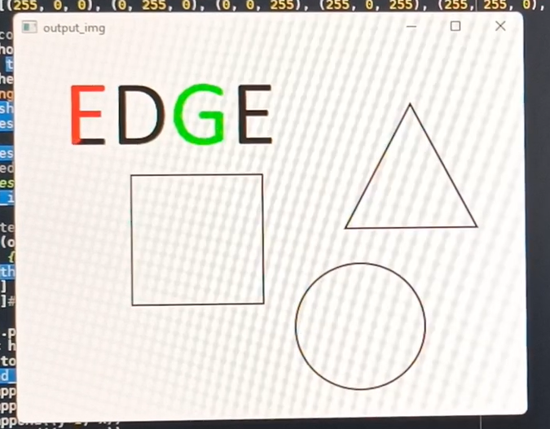
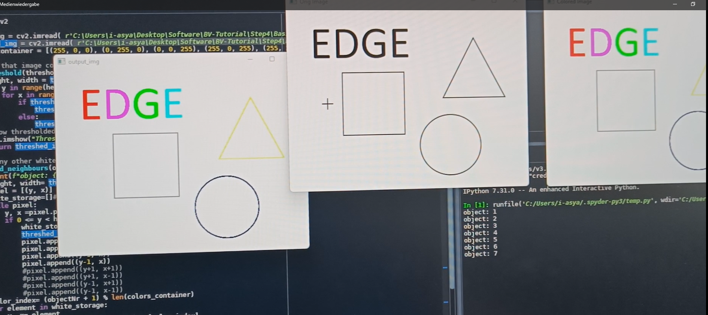
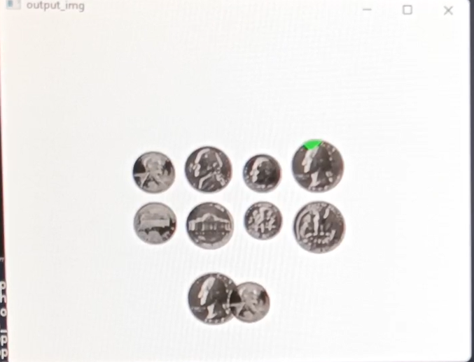
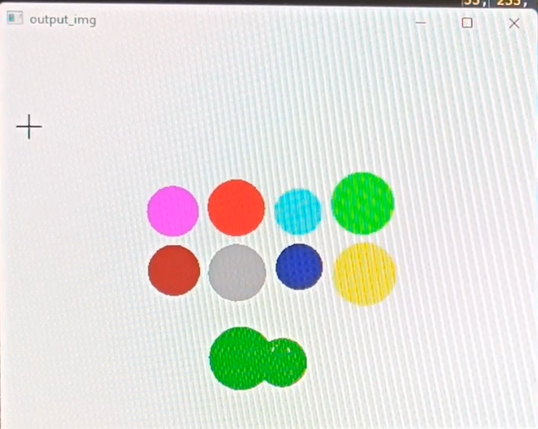
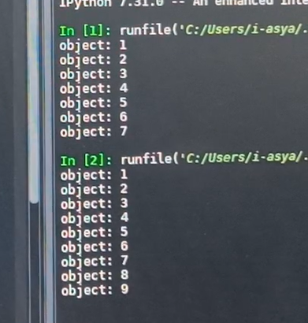

# Image Processing

This is a project that I worked on during an internship.  
It involves image processing and the use of various filters such as maximum, minimum, and median filters, as well as thresholding and object detection and coloring.  
The attached images can make it clearer how the final result looks.  
Due to data protection reasons, I am not publishing the code. Mentioning the filters makes it easy to understand how the project works.  
For this project, I used Python.

## Example Images

- Detecting different things, at the beginning  
    

- After detecting  
    

- Detecting different coins  
    

- The result of detecting different coins  
    

- Example for counting the found objects  
  
